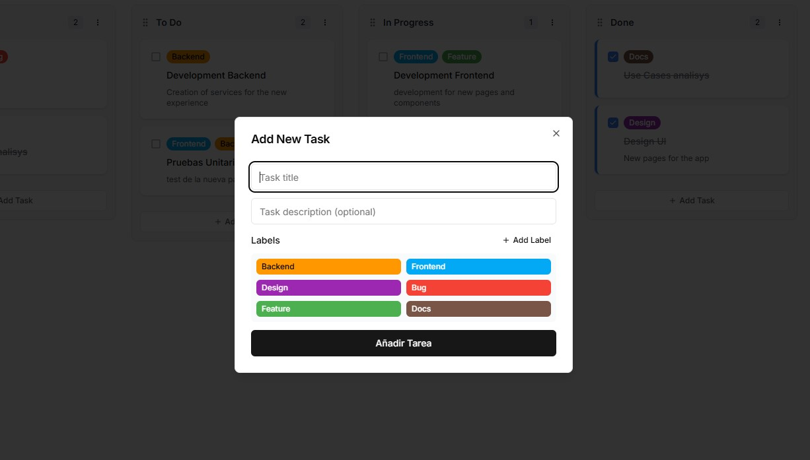

# Kanban Project

## Description
This is a Kanban-style task management project that allows users to create, edit, and organize tasks in different columns.

## Technologies Used

### Backend
- **Framework**: FastAPI
- **Database**: PostgreSQL (Neon)
- **ORM**: SQLAlchemy
- **Authentication**: JWT (JSON Web Tokens)
- **Environment**: Python 3.x

### Frontend
- **Framework**: React + Next
- **Libraries**: Axios (for HTTP requests), React Router (for navigation)
- **Styles**: Tailwind CSS 

## Screenshots

### Main Board


The main Kanban board displays all sections with their respective tasks. Each task has color-coded labels to identify its type (Frontend, Backend, Design, etc.). Tasks can be dragged and dropped between columns.

### Add New Task


The modal for adding new tasks allows you to enter a title, description, and select labels to categorize the task.

### Delete Confirmation


Before deleting a task, a confirmation dialog is displayed to prevent accidental deletions.

### Task Editing


The editing interface allows you to modify all details of an existing task, including its title, description, labels, and completion status.

## Main Features

- **Task Management**: Create, edit, delete, and move tasks between different sections
- **Custom Labels**: Organize your tasks with color labels (Frontend, Backend, Design, etc.)
- **Drag and Drop**: Intuitive interface for moving tasks between columns
- **Dark/Light Mode**: Support for dark and light themes
- **Responsive**: Adaptive design for mobile and desktop devices
- **Persistent Data**: All tasks and sections are saved in the database

## Setting Up the Project Locally

### Backend

1. **Clone the repository**:
   ```bash
   git clone https://github.com/your_username/your_repository.git
   cd your_repository/backend
   ```

2. **Create a virtual environment** (optional but recommended):
   ```bash
   python -m venv venv
   ```

3. **Activate the virtual environment**:
   - On Windows:
     ```bash
     venv\Scripts\activate
     ```
   - On macOS/Linux:
     ```bash
     source venv/bin/activate
     ```

4. **Install dependencies**:
   ```bash
   pip install -r requirements.txt
   ```

5. **Configure environment variables**:
   Make sure you have a `.env` file in the `backend` folder with the following configuration:
   ```plaintext
   DATABASE_URL=[CONNECTION LINK TO YOUR DATABASE]
   ```

6. **Start the server**:
   ```bash
   uvicorn app.main:app --reload
   ```

### Frontend

1. **Navigate to the frontend folder**:
   ```bash
   cd ../frontend
   ```

2. **Install dependencies**:
   ```bash
   npm install
   ```

3. **Start the server**:
   ```bash
   npm start
   ```

4. **Access the application**:
   Open your browser and go to `http://localhost:3000` to see the application running.

## Contributions
If you wish to contribute to this project, please open an issue or submit a pull request.

## LIVE DEMO
https://my-planning-tawny.vercel.app/

## License
This project is under the MIT License.

